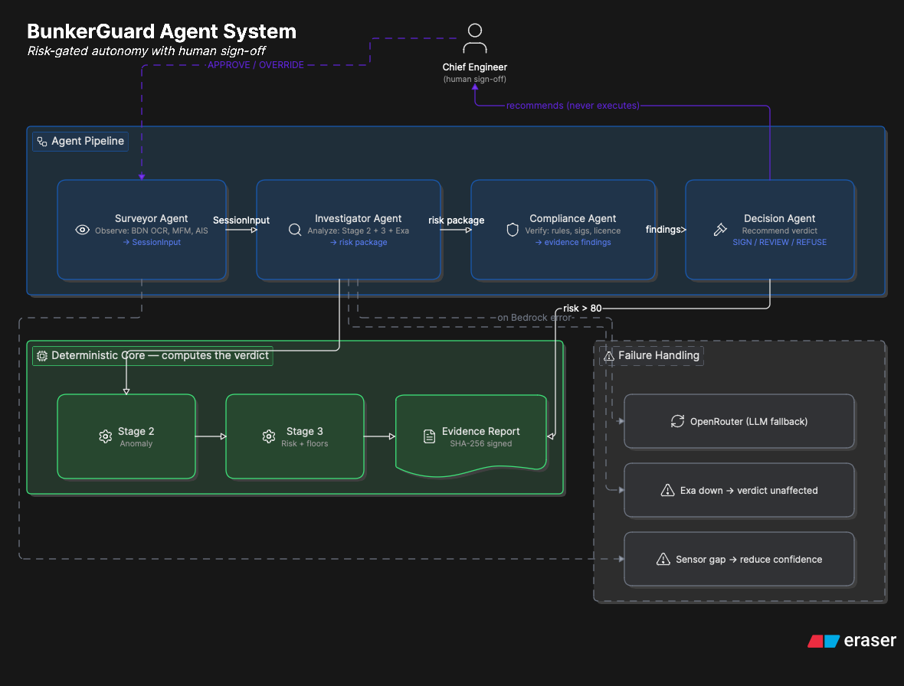
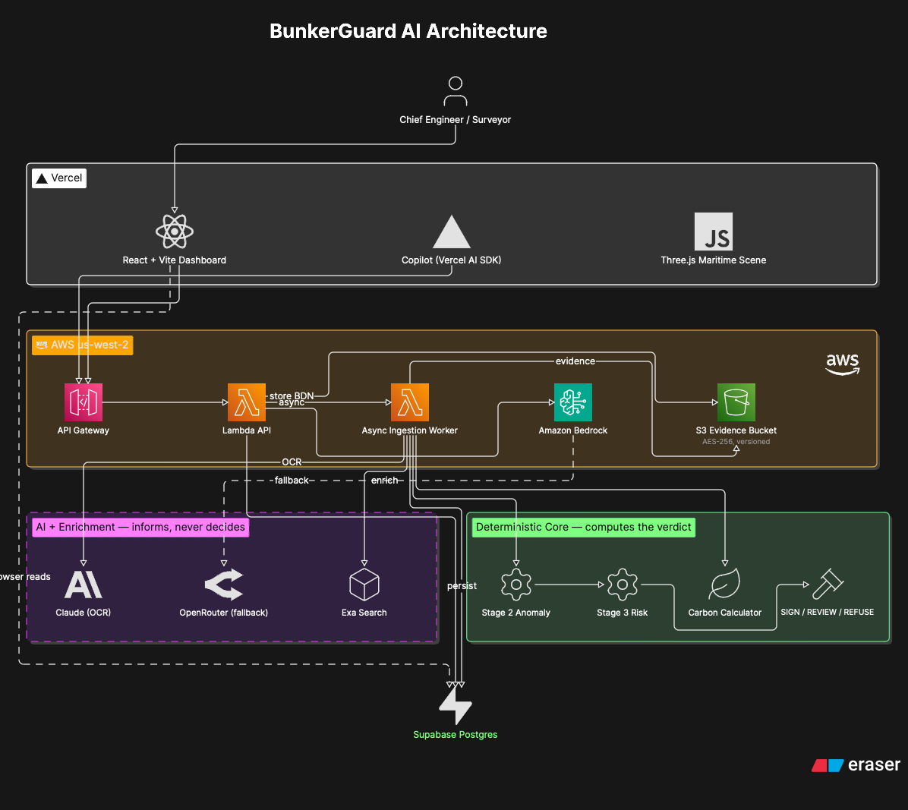
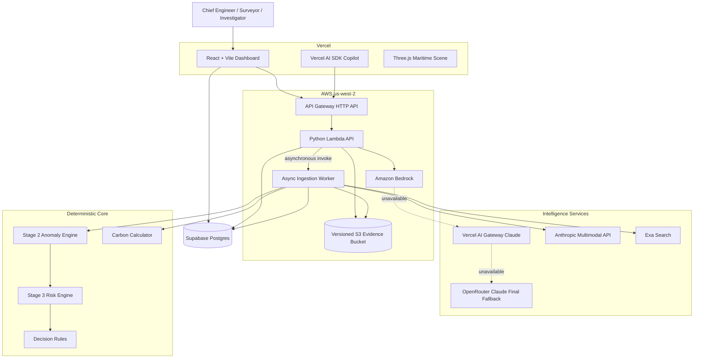
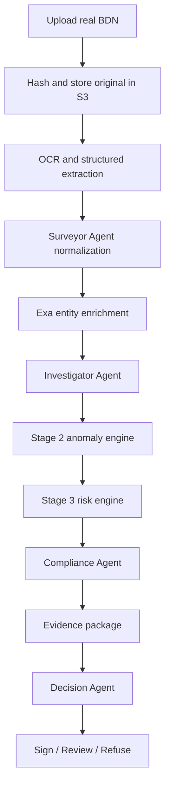
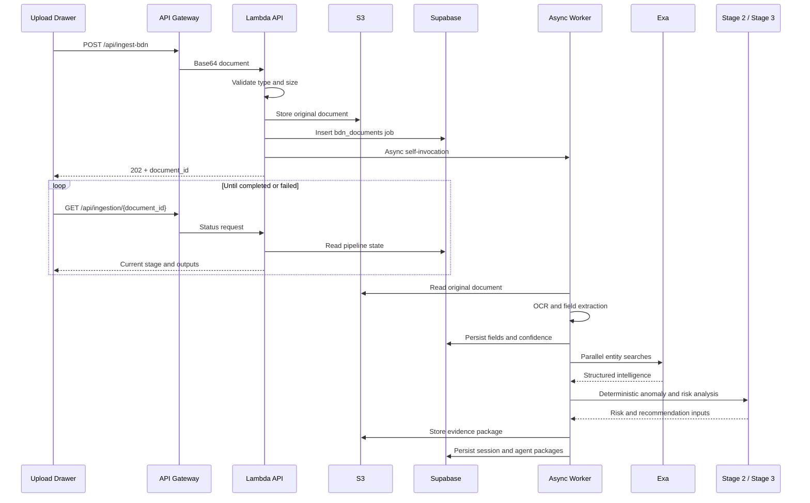
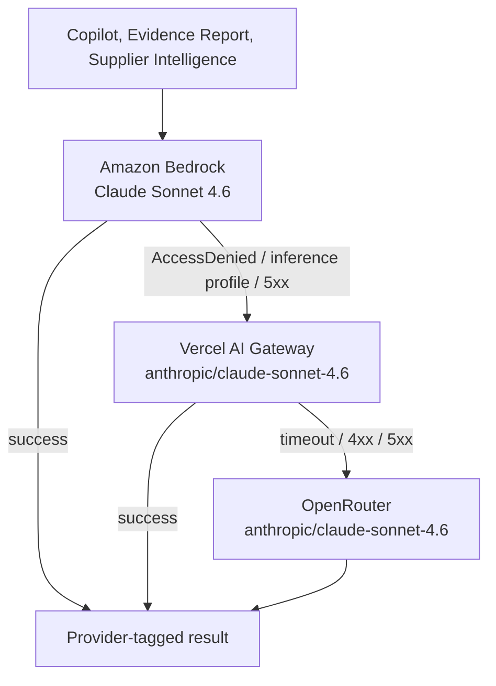
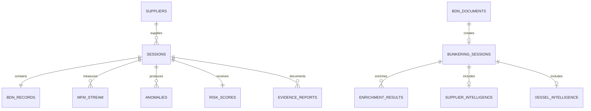

# BunkerGuard AI

> Agentic maritime intelligence for detecting bunker-delivery fraud, validating Bunker Delivery Notes, enriching supplier and vessel intelligence, producing auditable evidence, and supporting sign-off decisions.

[](https://bunkerguard-ai.vercel.app)
[](https://tf5wkg4t7d.execute-api.us-west-2.amazonaws.com/health)
[](https://supabase.com)
[](https://aws.amazon.com/bedrock/)
[](https://vercel.com/docs/ai-gateway)
[](https://exa.ai)

## Live Deployment

| Service | Production resource |
|---|---|
| Web application | [https://bunkerguard-ai.vercel.app](https://bunkerguard-ai.vercel.app) |
| AWS API Gateway | `https://tf5wkg4t7d.execute-api.us-west-2.amazonaws.com` |
| Health endpoint | [GET /health](https://tf5wkg4t7d.execute-api.us-west-2.amazonaws.com/health) |
| AWS region | `us-west-2` |
| S3 evidence bucket | `bunkerguard-ai-evidencebucket-odsosgkrmqcl` |
| Supabase project | `jdnzznxwdczcktfqwxmj` |

## Hackathon Stack Alignment

BunkerGuard AI is an agentic system whose autonomous workflows are exercised on
the partner stack of the hackathon (AWS, Vercel, Exa):

| Partner | Integration | Evidence |
|---|---|---|
| **AWS** | Lambda, API Gateway HTTP API, S3 (versioned, AES-256), CloudFormation, IAM, Amazon Bedrock (Claude Sonnet 4.6) | `infrastructure/template.yaml`, `infrastructure/deploy.sh`, deployed stack `bunkerguard-ai` in `us-west-2` |
| **Vercel** | Frontend hosting + **AI Gateway** as a production LLM provider (fallback chain) | `_call_vercel_ai_gateway` in `backend/llm/claude_client.py`, `AI_GATEWAY_API_KEY` env, Vercel dashboard AI Gateway tab |
| **Exa** | Live supplier, vessel, barge, and port intelligence on every BDN ingestion | `backend/enrichment/`, persisted to `enrichment_results` / `supplier_intelligence` / `vessel_intelligence` |

The agents take real actions on this stack: they upload BDNs to S3, write
sessions to Supabase, query Exa for live intelligence, call Claude via Bedrock
(with Vercel AI Gateway and OpenRouter fallback), generate hashed evidence
reports back into S3, and return deterministic SIGN / REVIEW / REFUSE verdicts.

## Overview

BunkerGuard AI addresses a high-risk maritime workflow: deciding whether the
receiving vessel should sign a Bunker Delivery Note after a fuel delivery.

The platform combines:

- real BDN document ingestion and OCR;
- deterministic maritime anomaly detection;
- deterministic risk scoring and verdict rules;
- Exa-powered supplier, vessel, barge, and port enrichment;
- agent-oriented investigation and compliance packages;
- LLM-assisted explanations and report narratives;
- S3 evidence retention and SHA-256 integrity metadata;
- Supabase operational persistence;
- fleet, supplier, session, carbon, and evidence interfaces;
- a Vercel-hosted React dashboard backed by AWS serverless infrastructure.

The central design principle is that LLMs explain and organize evidence, while
fraud scores, carbon values, and sign-off rules remain deterministic.

## Core Capabilities

| Capability | Implementation |
|---|---|
| Real BDN upload | PDF, JPEG, PNG, WEBP, and GIF documents up to 6 MB |
| Document storage | Original files are SHA-256 hashed and stored encrypted in S3 |
| OCR and extraction | Extracts vessel, supplier, barge, grade, quantity, port, date, licence, signatures, and fuel properties |
| Confidence scoring | Calculates overall and field-level confidence from actual extracted values |
| Session creation | Creates normalized `SessionInput`, `sessions`, and `bdn_records` rows |
| Exa enrichment | Searches supplier, vessel, barge, and port intelligence in parallel |
| Stage 2 detection | Runs the existing deterministic maritime anomaly engine |
| Stage 3 risk | Produces score, category, verdict, financial impact, and escalation requirements |
| Copilot | Uses the Vercel AI SDK frontend with the AWS `/api/copilot` endpoint |
| Evidence reports | Generates, hashes, stores, and displays evidence reports |
| Carbon intelligence | Calculates tCO2e from quantity and controlled fuel-grade factors |
| Supplier intelligence | Aggregates reputation, fraud history, exposure, and carbon data |
| 3D operations view | Renders terminal and bunkering-vessel GLBs with graceful fallbacks |

## Technology Stack

### Frontend

| Technology | Role |
|---|---|
| React 18 and TypeScript | Component framework and frontend contracts |
| Vite 6 | Development server and production build |
| React Router 7 | SPA routing |
| Tailwind CSS 4 | Utility styling |
| Material UI and Radix UI | UI primitives |
| Vercel AI SDK | Copilot text-stream integration |
| Supabase JS | Browser-side operational reads |
| React Three Fiber, Drei, Three.js | Maritime 3D visualization |
| MapLibre GL | Port and terminal mapping |
| Recharts | Risk, reputation, and carbon trends |
| Vitest | Frontend unit tests |
| Vercel | Production frontend hosting |

### Backend

| Technology | Role |
|---|---|
| Python 3.12 | Lambda runtime and intelligence pipeline |
| Pydantic 2 | Strict cross-stage contracts |
| AWS Lambda | Public APIs and asynchronous ingestion worker |
| API Gateway HTTP API | HTTPS routing and CORS |
| Amazon Bedrock Runtime | Primary Claude provider |
| Vercel AI Gateway | Production-grade Claude fallback provider |
| Anthropic SDK | Direct provider and multimodal document extraction |
| OpenRouter | Final Claude fallback |
| Exa Search API | Supplier, vessel, barge, and port context |
| boto3 | Bedrock, Lambda self-invocation, and S3 operations |
| pypdf | Text extraction from digital PDFs |
| Supabase Python SDK | Server-side persistence |
| pytest | Backend tests |

### Data and Infrastructure

| Technology | Role |
|---|---|
| Supabase Postgres | Sessions, telemetry, anomalies, intelligence, and reports |
| Amazon S3 | Uploaded BDNs, evidence packages, and reports |
| AWS CloudFormation | Lambda, IAM, API Gateway, routes, and S3 |
| GitHub | Source control and collaboration |

## System Architecture

### Agent orchestration


### System & tech stack




### Architectural Boundaries

| Boundary | Responsibility |
|---|---|
| Frontend | Visualization, interaction, upload, polling, and report display |
| API adapter | Validation, routing, CORS, provider metadata, and async dispatch |
| Ingestion layer | Document extraction, confidence, normalization, and persistence |
| Enrichment layer | External context only; never directly changes deterministic scores |
| Stage 2 | Maritime anomaly rules and evidence references |
| Stage 3 | Weighted score, regulatory floors, category, and verdict |
| LLM layer | Copilot explanations and narrative report content |
| Carbon layer | Formula-based supplementary environmental intelligence |
| Storage layer | S3 artifacts and Supabase operational state |

## End-to-End User Flow



| Step | Action | Result |
|---|---|---|
| 1 | User uploads a real BDN | Document is validated, hashed, and stored |
| 2 | Lambda starts an async worker | UI receives a job ID immediately |
| 3 | OCR extracts document values | Fields and confidence are persisted |
| 4 | Surveyor Agent normalizes the BDN | A typed bunkering session is created |
| 5 | Exa enrichment runs | Supplier, vessel, barge, and port context is stored |
| 6 | Investigator Agent invokes Stage 2 and Stage 3 | Anomalies, risk, and verdict are generated |
| 7 | Compliance Agent evaluates evidence | Missing licence, signatures, and concerns are listed |
| 8 | Evidence package is written | S3 receives the complete audit bundle |
| 9 | Decision Agent applies policy | `SIGN`, `REVIEW`, or `REFUSE` is returned |
| 10 | Frontend polling completes | User sees extraction, risk, evidence, and decision |

## Real BDN Ingestion

### Asynchronous Pipeline



### Supported Inputs

| Format | Processing path |
|---|---|
| Digital PDF | `pypdf` extraction followed by structured LLM extraction |
| Scanned PDF | Anthropic multimodal document extraction when configured |
| JPEG, PNG, WEBP, GIF | Anthropic multimodal extraction or OpenRouter image fallback |

Maximum upload size is 6 MB because the browser sends the document through API
Gateway as base64 JSON.

### Extracted Fields

- BDN reference;
- vessel name and IMO;
- supplier name and licence;
- barge name and IMO;
- fuel grade and delivered quantity;
- port and delivery date;
- start and end times;
- sulphur, density, viscosity, and flash point;
- sample seal;
- supplier and receiving-officer signatures.

Missing values remain null or are explicitly unknown. Confidence is calculated
from actual field presence, with identity and quantity fields weighted heavily.

### Live Status

```text
Uploaded
  -> OCR
  -> Extraction
  -> Enrichment
  -> Risk Analysis
  -> Evidence Generation
  -> Decision Recommendation
```

Every stage is persisted in `bdn_documents.pipeline_status`. The frontend does
not simulate processing with timers.

## Agent Architecture

| Agent | Inputs | Outputs | Scoring authority |
|---|---|---|---|
| Surveyor Agent | Uploaded BDN and extracted fields | Normalized `SessionInput` | No |
| Investigator Agent | Stage 2, Stage 3, and Exa context | Risk and anomaly package | Stage 2/3 only |
| Compliance Agent | Enrichment, signatures, licence, evidence | Compliance findings | No direct score mutation |
| Decision Agent | Risk package and compliance package | `SIGN`, `REVIEW`, or `REFUSE` | Deterministic policy |
| Copilot | Live context and user question | Explanation and guidance | No |

Exa findings are supplementary. They are persisted as supporting evidence and
do not directly modify the deterministic Stage 3 score.

## Agent Orchestration

The five agents (Surveyor, Investigator, Compliance, Decision, Chief Engineer)
are coordinated by an **Orchestrator** that plans the run, dispatches the
specialists, runs Exa enrichment in parallel with the deterministic engines,
and streams every step to the UI for inspection.

| Phase | Agent | Tool surface | Output |
|---|---|---|---|
| Plan | Orchestrator | `bedrock.claude-sonnet-4-6` | Dispatch plan for the run |
| Extract | Surveyor Agent | OCR + structured extraction | Typed `SessionInput`, field confidence |
| Detect | Investigator Agent | `anomaly_engine_v3` (Stage 2) | Anomaly findings with regulatory citations |
| Score | Investigator Agent | `risk_engine_v3` (Stage 3) | Weighted risk score, category, floors |
| Enrich | Investigator Agent | `exa.search` | Supplier, vessel, barge, port intelligence |
| Verify | Compliance Agent | `evidence_check` | Signatures, MPA licence, fuel spec, MFM integrity |
| Decide | Decision Agent | `policy_engine_v3` | `SIGN` / `SIGN_WITH_NOTES` / `SIGN_WITH_LOP` / `REFUSE_TO_SIGN` |
| Sign-off | Chief Engineer | `human_in_the_loop` | Audit-grade verdict locked to evidence package |

### Orchestrator Trace

The trace is exposed as an **Agent Activity** tab on `/sessions/:sessionId`
and as a panel at the top of the right rail on `/live`. Each event row
contains:

- `timestamp`
- `agent`
- `action`
- `tool_used`
- `input_summary`
- `output_summary`
- `confidence`
- `status` (`COMPLETED`, `SKIPPED`, `PENDING_HUMAN`, `FAILED`)

When the optional `agent_traces` Supabase table is present, the persisted
trace is rendered verbatim. Otherwise the trace is derived in the browser
from the same `sessions`, `bdn_records`, `risk_scores`, `anomalies`,
`enrichment_results`, and `evidence_reports` rows the pipeline already
wrote — so the panel is demo-safe even without the migration.

**Determinism boundary:** The Orchestrator and specialists narrate and
coordinate; they never decide the verdict. The final SIGN / REVIEW /
REFUSE rule remains the policy engine in `backend/risk/` and `backend/policy/`,
which is what auditors and regulators inspect.

## Anomaly and Risk Engines

### Stage 2

`backend/anomaly` runs deterministic rules against `SessionInput`, including:

- final and trajectory quantity mismatch;
- density and flow anomalies;
- reverse flow and meter faults;
- sulphur and flash-point violations;
- ordered-grade mismatch;
- vessel and IMO mismatch;
- anchorage and barge-proximity concerns;
- unlicensed supplier;
- missing signatures and sample seals;
- e-BDN authenticity and MFM stream integrity;
- cappuccino bunkering, VEF, CCAI, and sounding/ROB checks.

Each anomaly includes a stable ID, severity, regulatory basis, confidence, and
evidence references.

### Stage 3

`backend/risk` combines:

- anomaly severity;
- supplier history;
- document completeness;
- delivery deviation;
- regulatory floor rules;
- insufficient-data state;
- financial exposure.

The result includes score, category, verdict, escalation requirements, Letter
of Protest status, surveyor/resampling requirements, and a complete audit trace.

The Stage 2 and Stage 3 engines are reused unchanged by ingestion and
`POST /api/run-session`.

## LLM Architecture

BunkerGuard AI runs every Claude inference through a deterministic provider
chain. Each call is attempted against Bedrock first, then automatically falls
back to the Vercel AI Gateway, and finally OpenRouter. The chain is enforced
inside `backend/llm/claude_client.py` and is covered by `test_llm_fallback.py`.



| Priority | Provider | Configuration | Role |
|---|---|---|---|
| 1 | Amazon Bedrock | `LLM_PROVIDER=bedrock`, `BEDROCK_MODEL_ID` | Primary inference on AWS |
| 2 | Vercel AI Gateway | `AI_GATEWAY_API_KEY`, `VERCEL_AI_GATEWAY_MODEL` | Production fallback through Vercel |
| 3 | OpenRouter | `OPENROUTER_API_KEY`, `OPENROUTER_MODEL` | Final Claude fallback |
| dev | Anthropic SDK | `LLM_PROVIDER=anthropic`, `ANTHROPIC_API_KEY` | Local development and multimodal OCR |

Every Copilot, Evidence Report, and Supplier Intelligence response exposes the
provider that actually served the call:

```json
{
  "provider_used": "vercel_ai_gateway",
  "model": "anthropic/claude-sonnet-4.6"
}
```

`provider_used` may return `bedrock`, `vercel_ai_gateway`, or `openrouter` in
production. The `/health` endpoint also reports which providers are configured:

```json
{
  "bedrock_configured": true,
  "vercel_ai_gateway_configured": true,
  "openrouter_configured": true,
  "active_provider": "bedrock_with_vercel_ai_gateway_and_openrouter_fallback"
}
```

LLM output never determines carbon values, anomaly scores, or sign-off rules.
Evidence reports overwrite the environmental section with deterministic backend
calculations after the model returns.

### Vercel AI Gateway Integration

| Detail | Value |
|---|---|
| Endpoint | `https://ai-gateway.vercel.sh/v1/chat/completions` |
| Default model | `anthropic/claude-sonnet-4.6` |
| Auth header | `Authorization: Bearer $AI_GATEWAY_API_KEY` |
| Timeout | 8 seconds per call (prevents API Gateway 503s) |
| Retries | One retry inside the Vercel gateway; backend never loops |
| Surface area | Backend only — the API key is never sent to the browser |

The gateway integration lives in `_call_vercel_ai_gateway` and is exercised by
the Copilot, Evidence Report, and Supplier Intelligence pipelines. Requests
flowing through it appear in the Vercel dashboard under the AI Gateway tab.

### Evidence Report Reliability

The Evidence Report endpoint is engineered to complete inside the API Gateway
30-second window:

- deterministic fields (report id, header, evidence items, S3 metadata, carbon)
  are built by the backend in pure Python;
- only the executive summary, narrative, and recommended actions are LLM-generated;
- model calls use a hard 8-second timeout and a 260-token cap;
- a single deterministic retry maximum;
- on any LLM failure the backend returns a fallback narrative instead of HTTP 503;
- the response includes `provider_used`, `model`, `s3_key`, and `report_hash`.

## Carbon Intelligence

Carbon exposure is supplementary intelligence:

```text
estimated_carbon_tco2e =
    delivered_fuel_quantity_mt * emission_factor_tco2e_per_mt
```

| Fuel grade | Default factor |
|---|---:|
| VLSFO | 3.114 tCO2e/MT |
| HSFO | 3.114 tCO2e/MT |
| MGO | 3.206 tCO2e/MT |
| LNG | 2.750 tCO2e/MT |
| Biofuel blend | 2.100 tCO2e/MT |

Unknown grades use the VLSFO fallback and are marked as estimated from
available session data.

Carbon metrics appear in Fleet Intelligence, Supplier Dossier, Session
Overview, and Evidence Reports. Carbon never overrides fraud risk or sign-off.

## Evidence and Storage

### S3 Prefixes

| Prefix | Content |
|---|---|
| `uploaded-bdn/` | Original uploaded BDN files |
| `ingestion-evidence/` | Surveyor, investigator, compliance, and decision bundles |
| `evidence-packages/` | Stage 2 and Stage 3 API output |
| `generated-reports/` | Generated evidence reports |

The bucket uses AES-256 server-side encryption, versioning, lifecycle rules,
and Lambda-scoped IAM access.

Evidence reports include:

- session and delivery identification;
- BDN and MFM comparison;
- anomaly and fraud findings;
- deterministic risk assessment;
- financial exposure;
- deterministic environmental impact;
- recommended actions and sign-off status;
- SHA-256 report hash;
- optional anchoring metadata;
- S3 and Supabase persistence metadata.

## Frontend Architecture

### Routes

| Route | Purpose |
|---|---|
| `/` | Portfolio dashboard |
| `/live` | 3D live bunkering session |
| `/sessions` | Search, filter, inspect, and upload BDNs |
| `/sessions/:sessionId` | Session details, evidence, and carbon |
| `/intelligence` | Supplier network, alerts, agents, fleet and carbon |
| `/evidence` | Evidence center |
| `/reports` | Persisted report viewer |
| `/anomalies` | Rule-level anomaly monitoring |
| `/blockchain` | Hash and anchoring audit view |
| `/suppliers` | Supplier rankings |
| `/suppliers/:supplierId` | Supplier dossier |
| `/settings` | Configuration surface |

### Important Components

| File | Responsibility |
|---|---|
| `frontend/src/app/components/upload/BDNUploadDrawer.tsx` | Real BDN upload and pipeline polling |
| `frontend/src/app/components/PortCopilot.tsx` | Circular copilot and Vercel AI SDK chat |
| `frontend/src/app/components/evidence/EvidenceReportDrawer.tsx` | Report display |
| `frontend/src/app/components/live/LiveSessionScene.tsx` | Three.js bunkering scene |
| `frontend/src/app/components/three/ModelErrorBoundary.tsx` | GLB error isolation |
| `frontend/src/lib/useCarbonExposure.ts` | Fleet carbon aggregation |
| `frontend/src/lib/useSessionDetail.ts` | Session detail adapter |
| `frontend/src/lib/useSupplierReputation.ts` | Supplier dossier adapter |

GLB files are served from `frontend/public/models`. A model error boundary and
procedural vessel fallback prevent missing assets from blanking the app.

## Backend API

Base URL:

```text
https://tf5wkg4t7d.execute-api.us-west-2.amazonaws.com
```

| Method | Path | Purpose |
|---|---|---|
| `GET` | `/health` | Runtime, region, bucket, provider, and Exa health |
| `POST` | `/api/run-session` | Run Stage 2/3 and store evidence |
| `POST` | `/api/copilot` | Copilot response with provider metadata |
| `POST` | `/api/evidence-report` | Generate, hash, and persist report |
| `POST` | `/api/ingest-bdn` | Store document and start async ingestion |
| `GET` | `/api/ingestion/{document_id}` | Return pipeline and agent outputs |

### Health

```bash
curl https://tf5wkg4t7d.execute-api.us-west-2.amazonaws.com/health
```

### Copilot

```bash
curl -X POST \
  -H 'content-type: application/json' \
  -d '{"messages":[{"role":"user","content":"Explain the sign-off risk."}]}' \
  https://tf5wkg4t7d.execute-api.us-west-2.amazonaws.com/api/copilot
```

### Evidence Report

```bash
curl -X POST \
  -H 'content-type: application/json' \
  -d '{"session_id":"SES-2026-016"}' \
  https://tf5wkg4t7d.execute-api.us-west-2.amazonaws.com/api/evidence-report
```

### BDN Ingestion

```bash
FILE_BASE64="$(base64 < ./sample-bdn.pdf | tr -d '\n')"

curl -X POST \
  -H 'content-type: application/json' \
  -d "{
    \"filename\":\"sample-bdn.pdf\",
    \"content_type\":\"application/pdf\",
    \"file_base64\":\"${FILE_BASE64}\"
  }" \
  https://tf5wkg4t7d.execute-api.us-west-2.amazonaws.com/api/ingest-bdn
```

Poll the returned `document_id`:

```bash
curl \
  https://tf5wkg4t7d.execute-api.us-west-2.amazonaws.com/api/ingestion/DOCUMENT_ID
```

## Supabase Data Model



### Operational Tables

| Table | Purpose |
|---|---|
| `sessions` | Main frontend-compatible session |
| `bdn_records` | Normalized BDN values |
| `mfm_stream` | Meter telemetry |
| `anomalies` | Stage 2 findings |
| `risk_scores` | Stage 3 output |
| `suppliers` | Supplier identity, reputation, and carbon |
| `historical_transactions` | Supplier pattern history |
| `llm_outputs` | Narratives and explanations |
| `evidence_reports` | Generated report persistence |
| `anchorage_geofences` | Port-zone reference |
| `fuel_parameters` | Fuel specification limits |
| `fuel_prices` | Financial exposure reference |

### Ingestion and Intelligence Tables

| Table | Purpose |
|---|---|
| `bdn_documents` | File metadata, S3 key, hash, extraction, confidence, status |
| `bunkering_sessions` | Normalized session and four agent packages |
| `enrichment_results` | Supplier, vessel, barge, and port Exa JSON |
| `supplier_intelligence` | Structured supplier intelligence |
| `vessel_intelligence` | Structured vessel intelligence |

### Migrations

| Migration | Purpose |
|---|---|
| `20260606000001_init.sql` | Base schema |
| `20260609000100_evidence_reports.sql` | Report persistence |
| `20260610000200_carbon_exposure.sql` | Carbon fields |
| `20260610000300_evidence_report_anchor.sql` | Report anchor field |
| `20260610000400_real_bdn_ingestion.sql` | Upload, agents, and enrichment |

## Repository Structure

```text
bunkerguard-ai/
├── backend/
│   ├── anomaly/                 # Stage 2 rules
│   ├── contracts/               # Pydantic contracts
│   ├── enrichment/              # Exa intelligence
│   ├── ingestion/               # OCR and async workflow
│   ├── llm/                     # Providers, copilot, reports
│   ├── outputs/                 # PDF and data exports
│   ├── policy/                  # Detection thresholds
│   ├── risk/                    # Stage 3 scoring
│   ├── supabase/migrations/     # Database migrations
│   ├── tests/                   # Backend tests
│   ├── carbon.py                # Carbon utility
│   ├── lambda_app.py            # Lambda HTTP adapter
│   └── storage.py               # S3 helpers
├── frontend/
│   ├── public/models/           # Maritime GLB assets
│   ├── src/app/components/      # UI components
│   ├── src/app/pages/           # Routes
│   ├── src/lib/                 # Hooks and mapping
│   ├── .env.example
│   └── vercel.json
├── infrastructure/
│   ├── deploy.sh
│   └── template.yaml
└── README.md
```

## Local Development

### Prerequisites

- Node.js 20 or newer
- npm
- Python 3.12
- AWS CLI for cloud deployment
- Supabase CLI for migrations

### Clone and Run Frontend

```bash
git clone https://github.com/Scarce01/bunkerguard-ai.git
cd bunkerguard-ai/frontend
cp .env.example .env.local
npm install
npm run dev
```

Open `http://localhost:5173`.

### Backend Tests

```bash
cd bunkerguard-ai
python3.12 -m venv .venv
source .venv/bin/activate
pip install -r backend/requirements-lambda.txt pytest
PYTHONPATH=backend pytest -q backend/tests
```

### Frontend Tests

```bash
cd frontend
npm test
npm run build
```

## Environment Variables

Never commit `.env` or `.env.local`.

### Frontend

| Variable | Required | Purpose |
|---|---|---|
| `VITE_API_BASE_URL` | Yes | API Gateway base URL |
| `VITE_SUPABASE_URL` | Yes | Supabase project URL |
| `VITE_SUPABASE_ANON_KEY` | Yes | Browser-safe anon key |

### Backend

| Variable | Required | Purpose |
|---|---|---|
| `LLM_PROVIDER` | Yes | `bedrock` or `anthropic` |
| `AWS_REGION` | Yes | Runtime region |
| `BEDROCK_MODEL_ID` | For Bedrock | Model or inference-profile ID |
| `SUPABASE_URL` | Yes | Supabase project URL |
| `SUPABASE_SERVICE_ROLE_KEY` | Yes | Server-side persistence |
| `S3_BUCKET` | Yes | Evidence and document bucket |
| `EXA_API_KEY` | For enrichment | Exa key |
| `ANTHROPIC_API_KEY` | Optional | Direct provider and scanned OCR |
| `AI_GATEWAY_API_KEY` | Recommended | Vercel AI Gateway Claude fallback |
| `VERCEL_AI_GATEWAY_MODEL` | Optional | Defaults to `anthropic/claude-sonnet-4.6` |
| `OPENROUTER_API_KEY` | Optional | Final Claude fallback after Vercel AI Gateway |
| `OPENROUTER_MODEL` | Optional | OpenRouter model |
| `ACTIVE_PROVIDER` | Optional | Label exposed at `/health` |
| `CORS_ORIGIN` | Production | Allowed frontend origin |
| `VLSFO_SPOT_PRICE` | Optional | Financial exposure reference |

Lambda supplies `AWS_LAMBDA_FUNCTION_NAME` for asynchronous self-invocation.

## Deployment

### Supabase

```bash
supabase link --project-ref jdnzznxwdczcktfqwxmj --workdir backend
supabase db push --workdir backend
```

### AWS

Export secrets in the shell, not in source:

```bash
export AWS_REGION=us-west-2
export AWS_DEFAULT_REGION=us-west-2
export BEDROCK_MODEL_ID='YOUR_MODEL_OR_INFERENCE_PROFILE'
export SUPABASE_URL='https://YOUR_PROJECT.supabase.co'
export SUPABASE_SERVICE_ROLE_KEY='YOUR_SERVICE_ROLE_KEY'
export EXA_API_KEY='YOUR_EXA_KEY'
export AI_GATEWAY_API_KEY='YOUR_VERCEL_AI_GATEWAY_KEY'
export VERCEL_AI_GATEWAY_MODEL='anthropic/claude-sonnet-4.6'
export OPENROUTER_API_KEY='YOUR_OPENROUTER_KEY'
export OPENROUTER_MODEL='anthropic/claude-sonnet-4.6'
export ACTIVE_PROVIDER='bedrock_with_vercel_ai_gateway_and_openrouter_fallback'
export CORS_ORIGIN='https://bunkerguard-ai.vercel.app'

./infrastructure/deploy.sh
```

The script packages manylinux dependencies and backend modules, uploads the
artifact, deploys CloudFormation, and prints API, bucket, and function outputs.

### Vercel

```bash
npx vercel link --yes --project bunkerguard-ai
npx vercel --prod --yes
```

Production frontend variables:

```text
VITE_API_BASE_URL=https://tf5wkg4t7d.execute-api.us-west-2.amazonaws.com
VITE_SUPABASE_URL=...
VITE_SUPABASE_ANON_KEY=...
```

`frontend/vercel.json` defines the Vite build, `dist` output, and SPA rewrite
while preserving static `/assets` and `/models`.

## Testing and Verification

```bash
PYTHONPATH=backend .venv/bin/python -m pytest -q \
  backend/tests/test_document_ingestion.py \
  backend/tests/test_lambda_app.py \
  backend/tests/test_carbon.py \
  backend/tests/test_llm_fallback.py \
  backend/tests/test_evidence_report_service.py

cd frontend
npm test
npm run build
```

Current targeted verification:

- 14 backend tests pass;
- 4 frontend tests pass;
- Python modules compile;
- Vite production build succeeds;
- Supabase migrations apply;
- Lambda and API routes are deployed;
- CORS succeeds;
- Vercel serves the SPA and GLB asset;
- malformed BDN upload was tested through S3, async Lambda, persisted failure, and polling.

## Security and Business Rules

### Security

- no secrets are stored in source;
- `.env` files are ignored;
- frontend uses only the Supabase anon key;
- backend service-role access remains server-side;
- S3 uses encryption and versioning;
- uploaded files are type/size validated and SHA-256 hashed;
- Lambda permissions cover only required S3, Bedrock, and self-invocation actions;
- private contract keys are excluded from deployment artifacts;
- production CORS is restricted to the Vercel frontend.

### Business Rules

1. Fraud detection is the primary workflow.
2. Stage 2 and Stage 3 are deterministic.
3. Exa results are supporting context and require human verification.
4. LLM output may explain evidence but may not invent measurements.
5. Carbon is supplementary and never overrides risk or sign-off.
6. A BDN-only session stays under review until MFM reconciliation.
7. Regulatory hard floors may override weighted-score bands.
8. Missing evidence lowers confidence instead of being invented.

## Operational Notes

- Some Bedrock Claude models require an inference-profile ID for on-demand
  throughput. The client falls back to OpenRouter for access or profile errors.
- OpenRouter requests depend on account credit.
- Successful OCR requires a configured LLM provider. Digital PDF text
  extraction does not require multimodal input.
- Exa degrades to empty results on failure; deterministic processing continues.
- Newly uploaded BDNs have no MFM stream until telemetry is joined, so the
  initial recommendation is normally `REVIEW`.
- The hackathon API supports documents up to 6 MB. A production-scale version
  should use S3 presigned uploads.

## Scope

This repository is a hackathon-focused maritime intelligence demonstration.
Risk, regulatory, carbon, sanctions, and compliance outputs require review by
qualified maritime, legal, and environmental professionals before operational
use.
